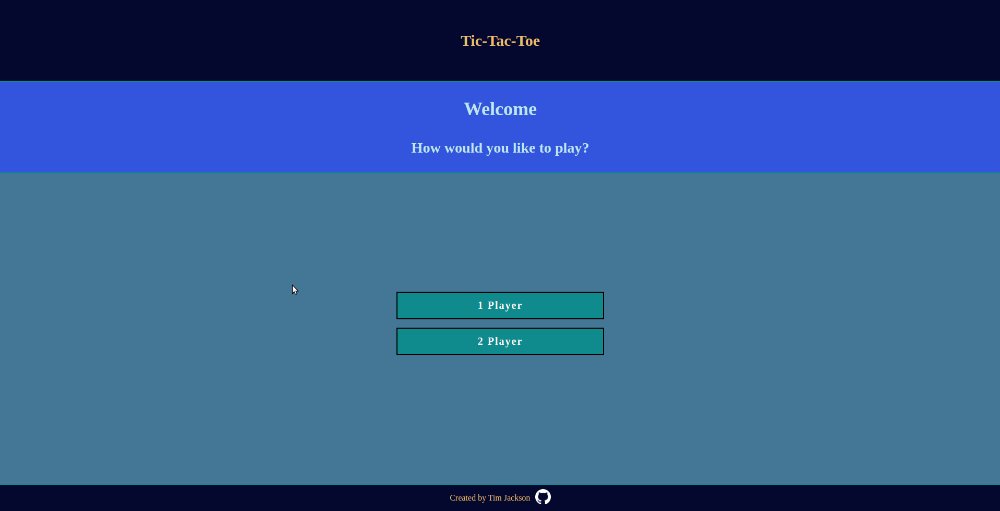

<h1 align="center">
   
  Tic-Tac-Toe
   
  <image src="graphics/tictactoelogo.png" width="50%"> 
</h1>

<h4 align="center">A game classic. I used JavaScript, HTML, and CSS for this project.</h4>

  <a href="#screenshots">Screenshots</a> •
  <a href="#goals">Goals</a> •
  <a href="#summary">Summary</a> •
  <a href="#author">Author</a> •
    <a href="#credits">Credits</a> •
  <a href="#license">License</a>

### ✨ [Live Preview](https://timjacksonm.github.io/Tic-Tac-Toe)

## Screenshots

  
Show Image

  

The next two images showcase responsive web design for Galaxy S5 & Ipad Pro.
  <image src="graphics/RWD.png">
  <image src="graphics/RWD2.png">

## Goals:
- [✔️] Create gameBoard , displayController and players. Use what I have learned using factories and modules to organize code.
- [✔️] Try to tuck everything away and have as little global code as possible.
- [✔️] Set up your HTML and write a JavaScript function that will render the contents of the gameBoard array to the web page.
- [✔️] Build the functions that allow players to add marks to a specific spot on the board, then tie it to the DOM.
- [✔️] Build the logic that checks for when the game is over! Should check for 3-in-a-row and a tie.
- [✔️] Clean up the interface to allow players to put in their names, include a button to start/restart the game and add a display element that congratulates the winning player!

**Optional Extra Credit**

- [✔️] Learn about responsive design and make game playable across multiple devices!
- [✔️] learn and apply how to add transition effects.
- [✔️] create an AI so that a player can play against the computer!
- [ ] Once AI is working, make it unbeatable!
- [ ] ~~add a light/dark mode button to the site.~~ I decided not to do extra credit here. As it doesn't make sense for a tic-tac-toe game. Will try on the next project!

**View Commits on project to see changes**

## Summary

This project was a lot of fun. It focused on modules and factories. No more writing code however I like. This took planning and a thought out process. As a personal goal I tried my best to learn responsive web design and incorporate the design in my project. I did add a few unique transitions to the game. The winning transitions are disabled if you are using a smaller screen "mobile friendly". Currently you can play 1 player (you vs computer) or 2 player. You can decide which players turn starts the game!

## Author

👤 **Tim Jackson**

- Github: [@timjacksonm](https://github.com/timjacksonm)
- Twitter [@timjacksonm](https://twitter.com/timjacksonm)
- LinkedIn [@timjacksonm](https://linkedin.com/in/timjacksonm)

## Credits

This project idea was a part of my studies at The Odin Project's curriculum. You can see the lesson <a href="https://www.theodinproject.com/paths/full-stack-javascript/courses/javascript/lessons/tic-tac-toe" target="_blank">here</a>!

## License

  <a href="https://choosealicense.com/licenses/mit/">
    

